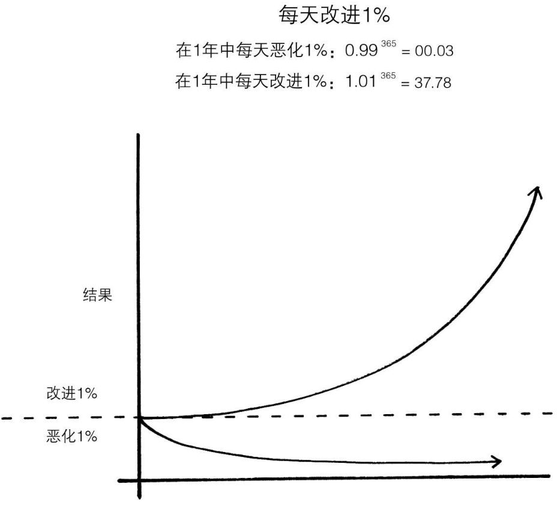
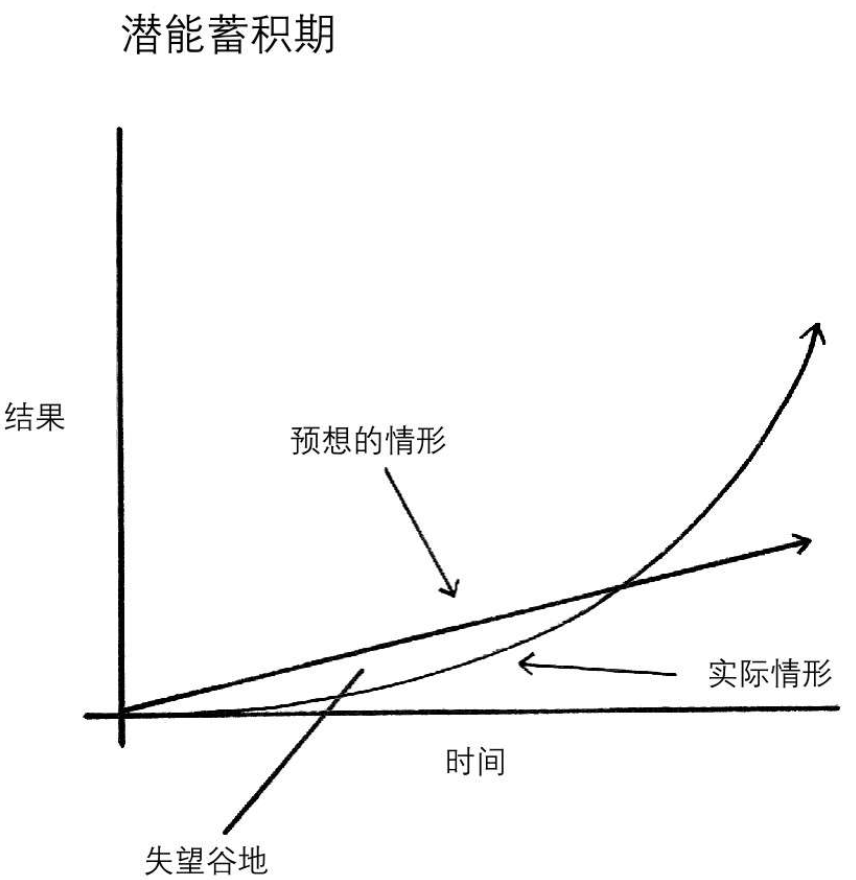

- # 基本原理
	- ## 第1章 微习惯的惊人力量
	  collapsed:: true
		-
		- ### 为什么习惯会带来大变化
			- 习惯是自我提高的复利。从长远来看，每天进步1%的效果不容小觑。
			- 
		- ### 你的习惯可能导致正或负复利
			- 习惯是把双刃剑。它们可能对你有利，也可能对你不利，这就是为什么理解细节至关重要。
				- 好习惯就会导致正复利，坏习惯会导致负复利，你将会变得越来越坏。
		- ### 什么是真正的进步
			- 冰块在0摄氏度以前，不会融化，当加热到0摄氏度时，冰开始融化。这仅仅上升了一度，但他引发了巨大的变化。
			- 突破时刻的出现通常是此前一系列行动的结果，这些行动积聚了引发重大变革所需的潜能。如癌细胞在80%的时间是检测不到的，只有最后几个月，癌细胞会突然出现接管身体。竹在长出来前需要在地下蛰伏5年，发展根系。蝉在爬出地面之前，也在地下生活十几年。
			- **类似地，你在培养习惯的过程中，有相当长时间是感受不到它的影响的，直到某一天，你突破了临界点，跨入新境界。**
				- 而在跨入这个新境界之前，你会经历长时间的低谷区，**这是任何复利进程的共同特征：最有力的结果总是姗姗来迟。**这也是很难养成持久习惯的核心原因之一。
			- 关键问题是，要想实现有意义的改变，新养成的习惯需要坚持足够长的时间，才能突破并无明显变化的平台期——我称之为**潜能蓄积期**。
			- ^^当你最终突破潜能蓄积期之际，人们会称之为一夜之间的成功。外部世界只看到最具戏剧性的薄发一瞬间，而无视之前厚积的漫长过程。^^但是你要知道，正是你很久以前下的那些功夫——当时你似乎看不到任何进展——才使得今天的飞跃成为可能。
			- _熟练掌握某种技能需要足够的耐心。_
				- 就像凿石头、雕刻，也许要凿100次，也需要凿101次才会凿动，这是一个积累的过程，而不是那一次的结果。
			- **那么什么是真正的进步？**
				- ^^真正的进步是个日积月累、潜移默化的过程，他不会立竿见影、一蹴而就。反而最终的重大突破会迟迟不到，考验着你的耐心。直到某一天，你突破了临界点，跨入新的境界。^^
		- ### 潜能蓄积期
			- 
			- 我们经常期望进步是线性的。至少，我们希望它有立竿见影的效果。实际上，我们做出努力后，**结果的显现往往滞后**。
				- 在一个新的习惯的开始，往往看不出任何的复利，不会有立竿见影的效果。
			- 不积跬步，无以至千里，每颗习惯的种子都来自单一的、微小的决定。但是随着这一决定不断得以重复，一种习惯就会生根发芽并茁壮成长；随着时间的推移，根扎得越来越深，枝叶也日益繁茂。戒除坏习惯犹如连根拔起我们内心枝繁叶茂的橡树，而**培养良好习惯则像每天不忘浇水，悉心培育一枝娇嫩的鲜花**。
			- 那么，究竟是什么决定着我们是否坚持足够长的时间，使我们想要培养的某种习惯安然度过潜能蓄积期，直至突破成为我们固有的习惯呢？又是什么因素导致一些人不由自主地沾染恶习，同时让另一些人享受到好习惯带来的复利效果呢？
				- 是什么决定着我们是否坚持足够长的时间？
				- 是什么因素导致一些人不由自主地沾染恶习，同时让另一些人享受到好习惯带来的复利效果？
			-
		- ### 忘记目标，专注于体系
			- ^^目标是关于你想要达到的结果，而体系是涉及导致这些结果的过程。^^
			- 任何一项运动的终极目标都是争取获得最好的成绩，但是在整场比赛中都死盯着记分牌则荒谬无比。**争取每天都有进步是你走向成功的唯一方法**。
			- 如果你想要更好的结果，那就别再紧盯着目标不放，而要把精力集中到你的体系建设上。这是什么意思？目标完全无用吗？当然不是。**目标的意义在于确定大方向，但体系会促进你的进步**。假如你为目标绞尽脑汁，却对体系设计关注不足的话，就会出现一些问题。
			- ^^**问题1：赢家和输家心怀相同的目标。**^^
				- 目标设定深受胜者王侯心态的影响。我们极为看重最终的赢者，或者说幸存者，并误以为夺取胜利的诀窍就在于雄心勃勃的目标，全然忘记了还有众多制定了同样目标的人最终却失败了。
				- 目标一直存在。只有在他们实施了一点一滴、循序渐进地改进体系之后，他们才取得了不同寻常的结果。
			- ^^**问题2：实现一个目标只是短暂的改变。**^^
				- 实现一个目标只会暂时改变你的生活。这正是改进这个概念违反直觉之处。我们本以为需要改变我们的结果，其实结果并不是导致问题产生的根源。真正需要改变的是导致这些结果的体系。假如你只是围绕着结果动脑筋想办法，你只能取得一时的改进。为了取得一劳永逸的成效，你需要解决体系层面上的问题。^^修正输入端，输出端就会自行修正^^。
					- 所以帮新月想办法解决问题，只能解决一时的结果，真正需要改变的是体系，而不是结果。但是她的体系是什么呢？
			- ^^**问题3：目标束缚了你的幸福感。**^^
				- 目标优先心态的问题是，你一直在延迟享受快乐，总是寄希望于下一个里程碑的实现。
					- 就像打游戏一样，每次都设定了嬴的目标，但其实体系才是更重要的，并不是我每次设定了嬴的目标，就都能嬴的。而是要在过程中，玩好每一步、每一个决策。目标舒服了我的幸福感。没有完成目标，我就会十分生气、气恼。完成了目标，也只是短暂的欢愉，然后开始下一把，重新设立嬴的目标。
				- 此外，**目标会导致“非此即彼”的冲突**：你要么实现了预定目标，最终取得了成功，要么你失败了并令人大失所望。**你在精神上把自己禁锢在一种狭隘的幸福观之中，这属于自我误导**。
				- 你实际走出的人生道路，不太可能与你出发时心目中的旅程完全匹配。**成功之路不止一条，你毫无必要认定只有某个特定场景的出现，才能让你对自己的人生感到满意。**
			- ^^**问题4：目标与长远改进的大方向不一致。**^^
				- 最后，**以目标为导向的思维定式会产生“溜溜球”效应**。
				- 许多跑步运动员可以连续不断地刻苦训练几个月，但是当他们完成了比赛之后就会偃旗息鼓，停止训练。赛事已然结束，不再激励他们刻苦训练。**当你所有的努力都集中在一个特定的目标上时，一旦目标实现，推动你努力前行的动力也就失去了依托**。这就是为什么许多人在完成预定目标后又恢复了旧习惯。
				- 设定目标的目的是赢得比赛。构建体系的目的是持续参与这项赛事。意在长远的思维方式不会拘泥于具体的目标。这不是为了取得任何单一的成就，而是一个精益求精、日趋进步的循环过程。^^归根结底，你对这个过程锲而不舍的坚持决定着你的进步。^^
		- ### 微习惯体系
			- 如果你很难改变自己的习惯，问题的根源不是你，而是你的体系。坏习惯循环往复，不是因为你不想改变，而是因为你用来改变的体系存在问题。
				- 为什么一直改不掉？
				- 无法坚持、拖延，如计划看书，大部分书，我只能坚持看完开头，后面就觉得：啊，我都看书评都知道怎么回事儿了，就不看了，以后有空再看吧。可能会一直拖延，明天再看吧、后天再看吧，并且总有理由：这本书几天就看完了，过几天再看也一样的。无法坚持，看十几分钟，就会想去做其他事情
			- ^^你要做的是，不求拔高你的目标，但求落实你的体系。^^
			- 关注整个体系，而非单一目标，这是本书的核心主题之一。
			- 习惯就像我们生活中的原子。每个基本单元都对你的整体进步有所贡献。
			-
		-
	- ## 第2章 你的习惯如何塑造你的身份（反之亦然）