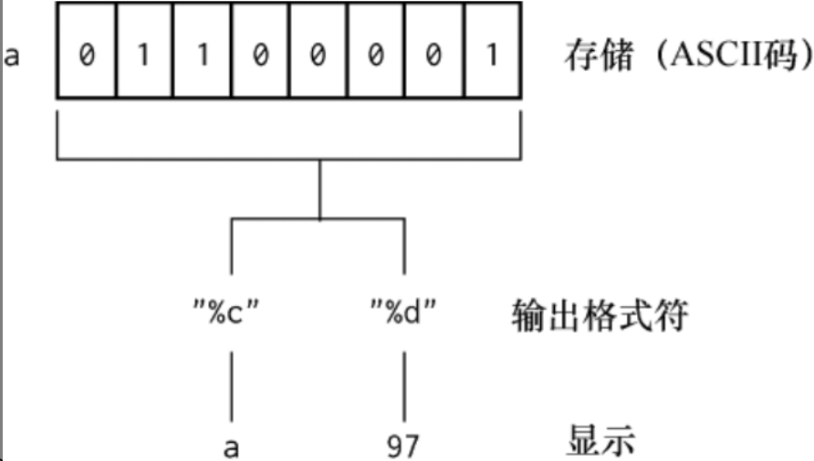
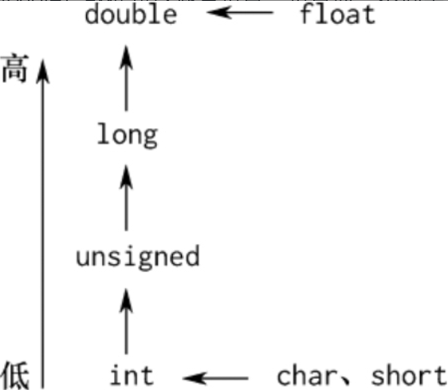

- # 第二章数据类型、运算符与表达式
	- ## 2.6字符型数据
		- 一个字符常量存放到一个字符型变量中时，实际上并不是把该字符的字型放到内存中，而是把该字符的ASCII码值放到存储单元中。
		- 
	- ## 2.7字符串常量
		- C语言规定，在每个字符串型常量的结尾加一个字符串结束标志，以便系统据此判断字符串是否结束。C语言规定以字符'\0'作为字符串结束标志。
			- 所以C计算字符串常量长度要+'\0'。
			- 如字符串常量"CHINA"在内存中存储占用六个字符：C H I N A \0 .即大小为6，但在输出时不输出\0，因为\0无法显示。
	- ## 2.8混合运算
		- 不同类型数据的转换级别如图2.8.1所示，从短字节到长字节的类型转换是由系统自动进行的，编译时不会给出警告；若反向进行，则编译时编译器会给出警告。
			- 
		- ### 2.8.1数值按int型运算
			- C语言中的整型数算术运算总是以默认整型类型的精度进行的。为了获得这个精度，表达式中的字符型和短整型操作数在使用之前会被转换为基本整型（int型）操作数，这种转换被称为整型提升（Integral Promotion）。例如，
				- ```cpp
				  char a,b,c;
				  a = b+c;
				  ```
				- b和c先被提升为整型数，然后执行加法运算。加法运算结果被截断，然后存放到a中。
			- 例：
				- ```cpp
				  char b = 0x93<<1>>1;
				  printf("%x\n",b);//ffffff93
				  b=0x93<<1;
				  b=b>>1;
				  printf("%x\n",b);//13
				  ```
				- 为什么第一个地方打印出ff ff ff 93？
					- 因为%x是取4字节进行输出的。所以有四个字节，又0x93少于4字节，所以需要填充，%x是按高位字节填充的，0x93最高位为1，所以填充1，变为ff ff ff 93.
				- 第二个地方为什么不同？都是一样的运算。
					- 因为0x93二进制为：ff ff ff 1001 0011，左移一位，变为：ff ff ff 0010 0110.
					- 存储于char类型中，高位截断为：0010 0110. 0x26
					- 在下一步右移中，char b 填充变为：00 00 00 0010 0110。右移变为：
					- 00 00 00 0001 0011。高位截断赋值给char b为：0x13.
				- 另一种情况如：
					- ```cpp
					  long l;
					  l = 131072*131072;
					  printf("%ld\n",l);//0
					  ```
					- 他的结果为什么为0？
						- 131072为int整型，二进制为10 00000000 00000000
						- 平方结果为：100 00000000 00000000 00000000 00000000，int型溢出，高位截断存储为00 00 00 00.结果为0.
					- 解决方法就是显式转换为longlong
						- ```cpp
						  l = (long long)131072*131072;
						  ```
					- 64位也可以转换为long
						- ```cpp
						  l = (long)131072*131072;
						  ```
		- ### 2.8.2浮点型常量默认按double型运算
			- 浮点型常量默认按8字节运算。如下：
				- ```cpp
				  float f = 12345678900.0+1;
				  double d =f;
				  printf("%f\n",f);               //12345678848.000000
				  printf("%f\n",12345678900.0+1);//12345678901.000000
				  printf("%f\n",d);               //12345678848.000000
				  ```
				- 第一个打印的值只有7位精度，原因是单精度浮点数f只有4字节的存储空间，能够表示的精度是6～7位，所以只保证1～7位是正确的，后面的都是近似值。第二个打印的值是正确的浮点型常量，它是按8字节即double型进行运算的，同时%f会访问寄存器8字节的空间进行浮点运算，因此可以正常输出。
	- ## 2.9常用的数据输入/输出函数
		- ### 2.9.1scanf函数的原理
			- 当scanf函数读取标准输入时，如果还没有输入任何内容，那么scanf函数会被卡住（专业用语为阻塞）
			- 缓冲区其实就是一段内存空间，分为读缓冲、写缓冲。C语言缓冲的三种特性如下。
				- 1. 全缓冲：当填满标准I/O缓存后才进行实际的I/O操作。全缓冲的典型代表是对磁盘文件的读写操作。
				  2. 行缓冲：在这种情况下，当I/O遇到换行符才进行真正的I/O操作。这是，我们的输入的字符会先存放到缓冲区中，等按下回车键换行，才会进行真正的输入输出。典型代表是标准输入缓冲区（stdin）和标准输出缓冲区（stdout）。
				  3. 不带缓冲：也就是不进行缓冲，标准出错情况（stderr）是典型代表，这使得出错信息可以直接尽快地显示出来。
			- ANSI C（C89）要求缓存具有下列特征。
				- （1）当且仅当标准输入和标准输出不涉及交互设备时，它们才是全缓存的。
				- （2）标准出错绝不会是全缓存的。
			- 我们向标准输入缓冲区中放入的字符为'20\n'，输入'\n'（回车）后，scanf函数才开始匹配，scanf函数中的%d匹配整型数20，然后放入变量i中，接着进行打印输出，这时'\n'仍然在标准输入缓冲区（stdin）内，如果第二个scanf函数为scanf("%d",&i)，那么依然会发生阻塞，因为scanf函数在读取整型数、浮点数、字符串（后面介绍数组时讲解字符串）时，会忽略'\n'（回车符）、空格符等字符（忽略是指scanf函数执行时会首先删除这些字符，然后再阻塞）。scanf函数匹配一个字符时，会在缓冲区删除对应的字符。因为在执行scanf("%c",&c)语句时，不会忽略任何字符，所以scanf("%c",&c)读取了还在缓冲区中残留的'\n'。
				- ```cpp
				  int i,j;
				  char c;
				  scanf("%d",&i);
				  printf("%d",i);
				  
				  //scanf("%d",&j);//如果第二个输入仍为整数，则会阻塞
				  //printf("%d",j);
				  
				  scanf("%c",&c);
				  printf("%c",c);
				  ```
			-
		- ### 2.9.2scanf函数的循环读取
			- fflush(stdin)函数
				- fflush函数具有刷新标准输入缓冲区的作用。但如果我们输入的是一个字符串，就不能加fflush函数，因为循环读取的原理是每次让scanf读取一个字符。读取一个字符串时，要一个一个读取字符。刷新后面就没了。
			- 如果我们输错了，输入的为字符型数据，那么scanf函数就无法匹配成功，scanf函数未匹配成功时其返回值为0，即ret的值为0，但这并不等于EOF，因为EOF的返回值为-1。当scanf函数无法匹配成功时，程序仍然会进入循环，这时会导致不断地重复打印。
		- ### 2.9.3多种数据类型混合输入
			- 当我们让scanf函数一次读取多种类型的数据时，对于字符型数据要格外小心，因为当一行数据中存在字符型数据读取时，读取的字符并不会忽略空格和'\n'（回车符）。编写代码时，我们需要在%d与%c之间加入一个空格。
				- ```cpp
				  scanf("%d %c%lf%f",&i,&c,&lf,&f);
				  ```
		- ### 2.9.4getchar函数介绍
			- 使用getchar函数可以一次从标准输入读取一个字符，它等价于charc,scanf("%c",&c)。
				- ```cpp
				  #include<stdio.h>
				  int getchar(void);
				  ...
				  char c=getchar();
				  ```
		- ### 2.9.5putchar函数介绍
			- 输出字符型数据时使用putchar函数，其作用是向显示设备输出一个字符
				- ```cpp
				  #include<stdio.h>
				  int puchar(int ch);
				  ...
				  putchar('H');
				  ```
				- 其中，参数ch是要输出的字符，它既可以是字符型变量、整型变量，又可以是常量。
		- ### 2.9.6printfh函数介绍
			- 实际原理是printf函数将这些类型的数据格式化为字符串后，放入标准输出缓冲区，然后通过'\n'来刷新标准输出，并将结果显示到屏幕上。
			- | 代码 | 格式                         |
			  | :--: | :--------------------------- |
			  |  %c  | 字符                         |
			  |  %d  | 带符号整数                   |
			  |  %i  | 带符号整数                   |
			  |  %e  | 科学计数法，使用小写"e"      |
			  |  %E  | 科学计数法，使用大写"E"      |
			  |  %f  | 浮点数                       |
			  |  %o  | 八进制数                     |
			  |  %s  | 一串字符                     |
			  |  %u  | 无符号整数                   |
			  |  %x  | 无符号十六进制数，用小写字母 |
			  |  %X  | 无符号十六进制数，用大写字母 |
			  |  %p  | 一个指针                     |
			  |  %%  | 一个'%'符号                  |
			- 位于%和格式化命令之间的一个整数被称为最小字段宽度说明符，通常会加上足够多的空格或0使输出足够长。如果想填充0，那么就在最小字段宽度说明符前面放置0.
			- 另外，也可以使用一个精度修饰符，精度修饰符根据使用的格式代码的不同通常有着不同的含义：
				- ●　用%e、%E和%f精度修饰符指定想要的小数位数。例如，%5.2f会至少显示5位数字并带有2位小数的浮点数。
				- ●　用%s精度修饰符简单地表示一个最大的长度，以补充句点前的最小字段长度。
			- printf函数的所有输出都是右对齐的，除非在%符号后放置了负号。例如，%-5.2f会显示5位字符、2位小数位的浮点数并且左对齐。
			-
			-
			-
			-
		-
	- ## 2.10运算符与表达式
		- ### 2.10.1运算符分类
			- （1）算术运算符（+- * / %）。
			- （2）关系运算符（> <==>=<=!=）。
			- （3）逻辑运算符（! && ||）。
			- （4）位运算符（<< >> ~ | ^ &）。
			- （5）赋值运算符（=及其扩展赋值运算符）。
			- （6）条件运算符（?:）。
			- （7）逗号运算符（,）。
			- （8）指针运算符（*和&）。
			- （9）求字节数运算符（sizeof）。
			- （10）强制类型转换运算符（(类型)）。
			- （11）分量运算符（.->）。
			- （12）下标运算符（[]）。
			- （13）其他（如函数调用运算符()）。
		- ### 2.10.2算术运算符及算术表达式
			- +- * / %中除取余运算符外，其他运算符都适用于浮点数，当操作数中有一个为浮点数时，执行浮点数除法。
		- ### 2.10.3关系运算符与关系表达式
			- 当判断整型变量i是否等于3时，我们可以写为3==i，即把常量写在前面而把变量写在后面。这是因为当不小心将两个等号写为一个等号时，变量在前面就会导致编译不通，从而快速发现错误（这种写法属于华为公司内部的一条编程规范）。
		- ### 2.10.4逻辑运算符与逻辑表达式
			- 逻辑运算符!、&&、||依次为逻辑非、逻辑与、逻辑或，这和数学上的与、或、非是一致的。
		- ### 2.10.5位运算符
			- 位运算符<<、>>、~、|、^、&依次是左移、右移、按位取反、按位或、按位异或、按位与。
			- **左移**：高位丢弃，低位补0，相当于乘以2。工作中很多时候申请内存时会用左移，例如要申请1GB大小的空间，可以使用malloc(1<<30)。malloc函数的使用将在后面的章节中介绍。
			- **右移**：低位丢弃，正数的高位补0，负数的高位补1，相当于除以2。移位比乘法和除法的效率要高，负数右移，对偶数来说是除以2，但对奇数来说是先减1后除以2。例如，-8>>1，得到的是-4，但-7>>1得到的并不是-3而是-4。另外，对于-1来说，无论右移多少位，值永远为-1。
		- ### 2.10.6赋值运算符
			- 左值是那些能够出现在赋值符号左边的东西，右值是那些可以出现在赋值符号右边的东西。如：
				- ```cpp
				  a=b+25;
				  //a是左值，b是右值
				  ```
			- **赋值运算符的优先级是非常低的，仅高于逗号运算符。**
				- ```cpp
				  //循环读取,=运算符优先级低，所以要括起来
				  char c;
				  while((c=getchar())!=EOF)
				  {}
				  ```
		- ### 2.10.7条件运算符与逗号运算符
			- 条件运算符：?:
			- 逗号运算符的优先级最低，我们需要掌握的是，逗号表达式的整体值是最后一个表达式的值。通过逗号运算符，我们可以先做一些准备操作，而最终while循环是否结束取决于scanf("%d%d%d",&a,&b,&c)!=EOF这个关系表达式的真假。
				- ```cpp
				  while( fflush(stdin), scanf("%d%d%d", &a, &b, &c ) != EOF )
				  {}
				  
				  ```
		- ### 2.10.8自增、自减运算符及求字节运算符
		-
- # 第三章选择与循环
  collapsed:: true
	- ## 3.1选择结构程序设计
		- ### 3.1.1关系表达式与逻辑表达式
		- ### 3.1.2if语句
		- ### 3.1.3switch语句
			- 语句格式：
			- ```cpp
			  switch(表达式)
			  {
			    case 常量表达式1:语句1;
			    case 常量表达式2:语句2;
			    case 常量表达式3:语句3;
			    ...
			    case 常量表达式n:语句n
			      default:语句n+1;
			  }
			  ```
	- ## 3.2循环结构程序设计
		- ### 3.2.1goto语句
			- goto语句的使用场景分为两种：一种是向上跳转实现循环，另一种是向下跳转实现中间的部分代码不执行。goto只能在一个函数内使用
				- ```cpp
				  //计算100内和
				  //向上跳转循环：
				  	int i=1;
				  	int total=0;
				  lable:
				  	total+=i;
				  	if(i<100)
				  	{
				    		goto lable;
				  	}
				  
				  //向下跳转跳过代码
				  	if(disk==0)
				      {
				        goto lable_disk_error;
				      }
				  lable_disk_error:
				  	printf("system is error\n");
				  ```
		- ### 3.2.2while循环
			- **在Windows操作系统下的VS集成开发环境中，我们可以用fflush或rewind清空标准输入缓冲区，但是这些函数在Linux操作系统中是无法使用的。那么如何自己写一个清空缓冲区的方法？可以用以下代码解决：**
				- ```cpp
				  while((ch=getchar())!=EOF && ch!='\n');//即：读到\n就刷新缓冲
				  ```
		- ### 3.2.3dowhile循环
			- dowhile语句的特点是：先执行循环体，后判断循环条件是否成立。
		- ### 3.2.4for循环
		- ### 3.2.5continue语句
			- continue语句的作用为结束本次循环，即跳过循环体中下面尚未执行的语句，接着进行是否执行下一次循环的判断。
				- continue是结束本次循环。
				- break是跳出循环体，结束循环。
		- ### 3.2.6break语句
			- break语句的作用是结束整个循环过程，不再判断执行循环的条件是否成立。
		-
		-
	-
- # 第四章数组
  collapsed:: true
	- ## 4.1一维数组
	  collapsed:: true
		- ### 4.1.1　数组的定义
		- ### 4.1.2　一维数组在内存中的存储
			- 一维数组的初始化方法：
				- （1）在定义数组时对数组元素赋初值。例如，
					- ```cpp
					  int a[10]={0,1,2,3,4,5,6,7,8,9};
					  //不能写成：
					  int a[10];
					  a[10]={0,1,2,3,4,5,6,7,8,9};
					  ```
				- （2）可以只给一部分元素赋值。例如，
					- ```cpp
					  int a[10]={0,1,2,3};
					  ```
				- （3）如果要使一个数组中全部元素的值为0，那么可以写为
					- ```cpp
					  int a[10]={0,0,0,0,0,0,0,0,0,0};
					  int a[10]={0};
					  ```
				- （4）在对全部数组元素赋初值时，由于数据的个数已经确定，因此可以不指定数组的长度。例如，
					- ```cpp
					  int a[]={1,2,3,4};
					  ```
			- 由于后定义的变量在上面，因此这种效果称为栈向上增长。
				- 就是先定义的变量地址更大，后定义的变量放在低地址。
			- 实际数组名中存储的是数组的首地址，在调用函数传递时，是将数组的首地址给了变量b
				- 所以修改函数中的数组值，原数组值也会变，因为传的是数组首地址，而不是另一个形参
		- ### 4.1.3　栈空间和数组
			- Windows操作系统中单个函数的栈空间大小是1MB，Linux操作系统中单个函数的栈空间大小是10MB（Linux操作系统下可以修改），单个函数的栈空间上限如下所示
				- ```cpp
				  #define N 250000 //260000则超出
				  int main()
				  {
				    int arr[N]={0};
				    system("pause");
				  }
				  ```
			- 在Windows操作系统中，函数栈空间大小超出1MB后会出现什么情况？如例4.1.3所示，若将N设置为250000，则这时运行没有任何异常，但若把N的值改为260000，则执行时就会出现Stack Overflow（栈空间溢出）错误，这是因为数组是定义在栈空间上的，当数组的大小为260000时就超出了单个函数的栈空间，因此就会发生栈空间溢出，所以在使用栈空间时，尽量不要使用过大的数组。如果需要使用大数组，那么使用堆空间（在下一章会讲解）即可。
	- ## 4.2二维数组
	  collapsed:: true
		- ### 4.2.1　二维数组的定义与引用
			- 可以将二维数组视为一种特殊的一维数组：一个数组中的元素类型是一维数组的一维数组。
			- 二维数组中的元素在内存中的存储规则是按行存储，即先顺序存储第一行的元素，后顺序存储第二行的元素，数组元素的获取依次是从a[0][0]到a[0][1]，直到最后一个元素a[2][3]。
		- ### 4.2.2　二维数组的初始化及传递
			- 可以用下面4种方法对二维数组初始化。
				- （1）分行给二维数组赋初值。例如，
					- ```cpp
					  int a[3][4]={{1,2,3,4},{5,6,7,8},{9,10,11,12}};
					  ```
				- （2）将所有数据写在一个花括号内，按数组排列的顺序对各元素赋初值。例如，
					- ```cpp
					  int a[3][4]={1,2,3,4,5,6,7,8,9,10,11,12};
					  ```
				- （3）对部分数组元素赋初值。例如，
					- ```cpp
					  int a[3][4]={{1},{5},{9}};
					  /*赋值效果
					  1 0 0 0
					  5 0 0 0
					  9 0 0 0
					  */
					  ```
				- （4）如果对全部元素赋初值，那么定义数组时可以不指定第一维的长度，但要指定第二维的长度。例如，
					- ```cpp
					  int a[3][4]={1,2,3,4,5,6,7,8,9,10,11,12};
					  //等价于
					  int a[][4]={1,2,3,4,5,6,7,8,9,10,11,12};
					  ```
			- 二维数组的初始化、函数间的传递及内存存储情况。
				- 由图4.2.4可以看出，二维数组中的每个元素都按顺序存储，从低地址到高地址，大小为sizeof(int)*元素个数，元素个数为行乘以列，共12个元素，所以大小为48字节。执行到print函数时，按F11键即可进入print函数。二维数组在传递时，列数一定要写，因为二维数组传递时也是以指针变量形式传递的，列数要与主函数中二维数组a的列数相同。图4.2.5也显示了代码的执行效果，从中可以看出b的地址值与a的相等，同时sizeof(b[0])的值为16，b[0]代表第一行，是一个一维数组，除以sizeof(int)就可以得到一行中元素的个数。二维数组在打印时，外层为行，内层为列，这样就可以以矩阵效果打印二维数组中的每个元素。
	- ## 4.3字符数组
	  collapsed:: true
		- ### 4.3.1　字符数组的定义及初始化
			- 字符数组的初始化可以采用以下方式。
				- （1）对每个字符单独赋值进行初始化。例如，
					- ```cpp
					  c[0]='a';
					  c[1]='d';
					  c[2]='w';
					  ```
				- （2）对整个数组进行初始化。例如，
					- ```cpp
					  char c[10]={'l','o','u'};
					  ```
			- 但工作中一般不用以上两种初始化方式，因为字符数组一般用来存取字符串。通常采用的初始化方式是char c[10]="hello"。因为C语言规定字符串的结束标志为'\0'，而系统会对字符串常量自动加一个'\0'，为了保证处理方法一致，一般会人为地在字符数组中添加'\0'，所以字符数组存储的字符串长度必须比字符数组少1字节。例如，char c[10]最长存储9个字符，剩余的1个字符用来存储'\0'。
			- 为什么对数组赋值"hello"却打印出很多“烫”字？这是因为printf通过%s打印字符串时，原理是依次输出每个字符，当读到结束符'\0'时，结束打印；scanf通过%s读取字符串，对c和d分别输入"are"和"you"（中间加一个空格），scanf在使用%s读取字符串时，会忽略空格和回车。
			- 我们通过print函数模拟实现printf的%s打印效果，如图4.3.3所示，当c[i]为'\0'时，其值是0，循环结束，也可以写为c[i]!='\0'。
		- ### 4.3.2　gets函数与puts函数
			- gets函数类似于scanf函数，用于读取标准输入。前面我们已经知道scanf函数在读取字符串时遇到空格就认为读取结束，所以当输入的字符串存在空格时，我们需要使用gets函数进行读取。
			- gets函数格式如下：
				- ```cpp
				  char *gets(char *str);
				  ```
			- gets函数从STDIN（标准输入）读取字符并把它们加载到str（字符串）中，直到遇到换行符（\n）或到达EOF。
			- gets函数从STDIN（标准输入）读取字符并把它们加载到str（字符串）中，直到遇到换行符（\n）或到达EOF。如图4.3.4所示，在第8行打断点，执行后，我们输入"how are you"，共11个字符，可以看到gets会读取空格，同时可以看到我们并未给数组进行初始化赋值，但是最后有'\0'，这是因为gets遇到\n后，不会存储\n，而是将其翻译为空字符'\0'。
				- ```cpp
				  char c[20];
				  gets(c);//读取字符串，可以读取空格
				  puts(c);
				  system("pause");
				  ```
		-
			- puts函数类似于printf函数，用于输出标准输出。puts函数的格式如下：
				- ```cpp
				  int puts(char *str);
				  ```
			- 函数puts把str（字符串）写入STDOU（标准输出）。puts执行成功时返回非负值，执行失败时返回EOF。如图4.3.4所示，puts会将数组c中存储的"how are you"字符串打印到屏幕上，同时打印换行，相对于printf函数，puts只能用于输出字符串，同时多打印一个换行符。
		- ### 4.3.3　str系列字符串操作函数
			- str系列字符串操作函数主要包括strlen、strcpy、strcmp、strcat等.
			- strlen函数用于统计字符串长度，strcpy函数用于将某个字符串复制到字符数组中，strcmp函数用于比较两个字符串的大小，strcat函数用于将两个字符串连接到一起。
			- 各个函数格式如下：
				- ```cpp
				  #include<string.h>
				  size_t strlen(char *str);
				  char *strcpy(char *to,const char *from);//目标数组一定要大于字符串大小，
				  //不然会访问越界
				  int strcmp(const char *str1,const char *str2);
				  char *strcat(char *str1,const char *str2);//目标数组必须大于拼接后的字符串大小，
				  //对于传参类型char*，直接放入字符数组的数组名即可。
				  
				  //strlen实现原理
				  int mystrlen(char c[])
				  {
				    int i=0;
				    while(c[i++]);
				    return i-1;
				  }
				  ```
			- strcmp如何比较大小？
				- 如何比较两个字符串的大小呢？具体操作是从头开始，比较相同位置字符的ASCII码值，若发现不相等则直接返回，否则接着往后比较。
				- 例如，strcmp("hello","how")的返回值是−1，即"hello"小于"how"，因为第一个字符h相等，接着比较第二个位置的字符，e的ASCII码值小于o的，然后返回−1。
		- ### 4.3.4　strn系列字符串操作函数
			- strn系列字符串操作函数包括strncpy函数、strncmp函数和strncat函数。
			- 只需要复制一部分原字符串中的字符时，使用strncpy函数；只需要比较两个字符串的一部分是否相等时，使用strncmp函数；需要将一个字符串的部分字符拼接到另一个字符串时，使用strncat函数。
		- ### 4.3.5　mem系列操作函数
			- 虽然将mem系列函数放到字符数组这一章进行讲解，但是mem系列函数其实是任何类型的数组都可以进行操作的，无论是字符型数组、整型数组、浮点型数组，还是后续章节中要讲到的结构体数组。
			- **mem系列函数包括memset函数、memcpy函数、memmove函数、memcmp函数等。**
			- 需要将一个数组的全部元素置为0时，要使用memset函数
				- ```cpp
				  void *menset(void *buffer,int ch,size_t count));
				  ```
			- memset函数可以用于将一段内存初始化为某个值
				- ```cpp
				  memset(the_array,'\n',sizeof(the_array));
				  ```
			- 需要将一个整型数组、浮点型数组的数据，或者某部分元素复制到另外一个数组时，不能使用strcpy函数，而要使用memcpy函数，其具体格式如下：
				- ```cpp
				  void *memcpy(void *to,const void *from,size_t count);
				  ```
				- 功能：函数从from中复制count个字符到to中，并返回to指针。如果to和from重叠，那么函数行为不确定
			- 当复制的内容发生重叠时，需要用memmove函数而不能用memcpy函数，具体格式如下：
				- ```cpp
				  void *memmove(void *to,const *from,size_t count);
				  ```
				- 功能：与mencpy函数相同，不同的是当to和from的内容有重叠时，函数仍能正常工作。
				  id:: 626e0091-809b-4dc8-973f-509e32c48d69
			- 需要比较两个数组中的前若干字符时，要使用memcmp函数，具体格式如下：
				- ```cpp
				  int memcmp(const void *buffer1,const void *buffer2,size_t count);
				  ```
				- 功能：函数比较buffer1和buffer2的前count个字符，函数返回值如下：
					- | 返回值         | 解释                            |
					  | :------------- | :------------------------------ |
					  | less than 0    | buffer1 is less than buffer2    |
					  | equal to 0     | buffer1 is equal to buffer2     |
					  | greater than 0 | buffer1 is greater than buffer2 |
					- memcmp函数可以比较任何类型的数组，主要比较两个数组是否相同，**其内部原理实际上是逐个比较字节的大小，count变量用来控制要比较的字节数量。**
			-
- # 第五章指针
  collapsed:: true
	- ## 5.1　指针的本质
		- ### 5.1.1　指针的定义
			- 在C语言中，指针变量是一种特殊的变量，它用来存放变量地址。
			- 格式如下：
				- ```cpp
				  基类型 *指针变量名;
				  ```
			- 指针和指针变量是两个概念，指针是指一个数的地址，而存放这个地址的变量，称为指针变量；如变量i的地址为0x2000，则2000就是指针，而有另一变量存放了这个地址0x2000，则这个变量就是指针变量。
			- 指针变量本身占多大的内存空间呢？
				- 32位地址寻址范围为32位即4字节，sizeof(i_pointer)=4。如果编写的程序是64位，那么寻址范围就是8字节。
		- ### 5.1.2　取地址操作符与取值操作符
			- 取地址操作符为&，也称引用，通过该操作符我们可以获取一个变量的地址值；取值操作符为*，也称解引用，通过该操作符我们可以得到一个地址对应的数据。
			-
	-